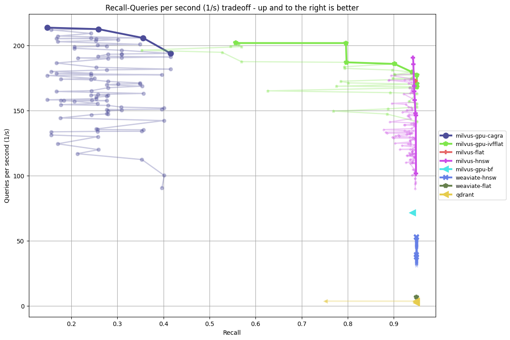
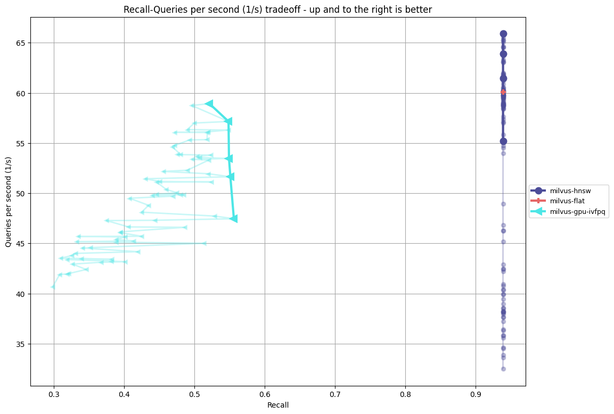
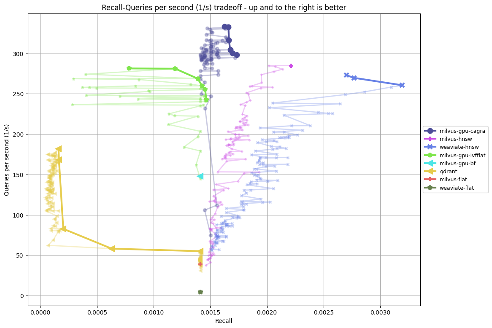
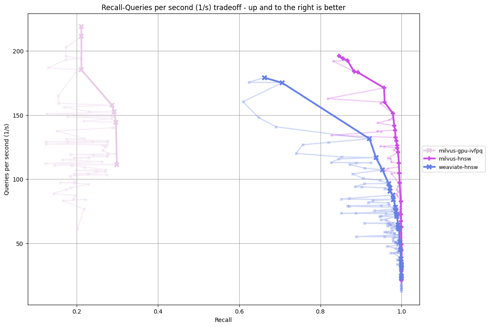

# BigVectorBench

[](https://github.com/BenchCouncil/BigVectorBench/blob/master/LICENSE)
[](https://github.com/BenchCouncil/BigVectorBench/actions/workflows/bvb-run.yml)
[](https://github.com/BenchCouncil/BigVectorBench/issues)
[](https://github.com/BenchCouncil/BigVectorBench/issues)
[](<[https://github.com/BenchCouncil/BigVectorBench/issues](https://github.com/BenchCouncil/BigVectorBench/pulls)>)
[](<[https://github.com/BenchCouncil/BigVectorBench/issues](https://github.com/BenchCouncil/BigVectorBench/pulls)>)

BigVectorBench is an innovative benchmark suite crafted to thoroughly evaluate the performance of vector databases. This project is born out of the realization that existing benchmarks fall short in assessing the critical capabilities of vector databases, particularly in handling heterogeneous data embeddings and executing compound queries. Our suite aims to fill this evaluation gap, providing a comprehensive framework for measuring the efficiency and capacity of vector databases in real-world scenarios.

## Install

### Clone the repository

```bash
git clone https://github.com/BenchCouncil/BigVectorBench.git
```

### Make Environment

Tested on: Ubuntu 20.04

- Docker Engine 27.x

  - For installation instructions, see [Install Docker Engine](https://docs.docker.com/engine/install/).
  - Enable Nvidia GPU support for Docker, see [NVIDIA Container Toolkit](https://docs.nvidia.com/datacenter/cloud-native/container-toolkit/install-guide.html) (Optional, only for GPU-based algorithms).

- Python 3.10 and dependencies
  - Create a new conda environment and install dependencies from `requirements.txt`:

```bash
conda create -n bigvectorbench python=3.10
conda activate bigvectorbench
pip3 install -r requirements.txt
```

### Build Docker Images for Databases

The command below will build the Docker images for all databases/algorithms used in the BigVectorBench.

```bash
python install.py
```

Arguments:

- `--proc NUM`: the number of process to build docker images (default: 1, build serially)
- `--algorithm NAME`: build only the named algorithm image (default: None, build all)

Issues:

- If you encounter an error while building the Docker image due to unreachable URLs, please try to modify the `Dockerfile` to use mirrors for the installation of the required packages.

### Run Benchmarks

```bash
python run.py
```

Arguments:

- `--dataset NAME`: run the benchmark on the named dataset (default: glove-100-angular)
- `-k COUNT`, `--count COUNT`: the number of near neighbours to search for (default: 10)
- `--runs COUNT`: run each algorithm instance COUNT times and use only the best result (default: 5)
- `--algorithm NAME`: run only the named algorithm (default: None, run all)
- `--cpuset-cpus CPUSET`: the CPUs in which to allow the container to run (e.g., 0-2, 0,1) only active in Docker mode (default: None, run on all CPUs)
- `--memory MEMORY`: the memory limit for Docker containers, default is all available memory (default: None, run with all available memory)

Example:

```bash
python run.py --dataset app_reviews-384-euclidean-filter --count 100 --runs 3 --algorithm milvus-hnsw --cpuset-cpus 0-15 --memory 64g
```

## Supported Databases and Algorithms

- [Milvus](https://milvus.io/)
  - milvus-flat
  - milvus-ivfflat
  - milvus-ivfsq8
  - milvus-ivfpq
  - milvus-hnsw
  - milvus-scann
  - milvus-gpu-bf
  - milvus-gpu-ivfflat
  - milvus-gpu-ivfpq
  - milvus-gpu-cagra
- [Weaviate](https://weaviate.io/)
  - weaviate-flat
  - weaviate-hnsw
- [Qdrant](https://qdrant.com/)
  - qdrant
- [Vearch](https://vearch.github.io/)
  - vearch-flat
  - vearch-biivf
  - vearch-ivfflat
  - vearch-ivfpq
  - vearch-hnsw
- [Redis](https://redis.io/)
  - redis-flat
  - redis-hnsw
- [Elasitcsearch](https://www.elastic.co/)
  - elasticsearch-hnsw
- [SPTAG](https://github.com/microsoft/SPTAG)
  - sptag-bkt
- [pgvector](https://github.com/pgvector/pgvector)
  - pgvector-hnsw
  - pgvector-ivfflat
  
**TODO**

- [Vespa](https://vespa.ai/)

## Use-cases for Compound Queries

We have summarized corresponding use-cases for filter queries, multi-modal queries, multi-vector queries, and big queries, including E-commerce recommendation, keyframe recommendation, cross-modal text-to-image search, and long text search, as shown in the figure below.


1. E-commerce recommendation is a fundamental use-case of vector retrieval, where product reviews are embedded into vectors by a text embedding model, such as all-MiniLM-L12-v2, and combined with attribute filters such as product ratings. This is a key function in e-commerce applications like Amazon book. Users who have given similar reviews and ratings to a particular book can mutually recommend books. When generating personalized recommendations, the recommendation engine not only retrieve similar book reviews but also incorporates filters based on book ratings to significantly enhance the relevance and efficacy of the recommendations.
2. Keyframe recommendation is an important use-case of vector retrieval. Keyframes are essential to the video-based applications, such as Twitch. Keyframes are extracted from original video to precisely summarize the video content. These vectors, derived from a user's viewing history, enable video-based applications to recommend videos or movies containing keyframes similar to those that are previously viewed, thereby providing more relevant contents that enhance recommendation accuracy based on past interactions.
3. Cross-modal text-to-image search is a pivotal use-case of vector retrieval, where both text and image are converted into vectors using multi-modal embedding models like ImageBind. This use-case is increasingly employed in popular social networking platforms such as TikTok and REDnote. Users can input textual descriptions --- for instance, detailing a historical event or artwork --- and the application then retrieves and displays images that are visually similar to the described content. This approach not only makes the information more accessible but also enhances its visual appeal, facilitating a more intuitive understanding of the search results.
4. Long text search represents an emerging use-case of vector retrieval that single text exceeding 1024 tokens are embedded into vectors with more than 768 dimensions using models like Jina Embeddings v2 or OpenAI embeddings. Long text search is a commonly used task in literature retrieval application allowing researchers to input entire documents and quickly locate the top-k academic publications by performing approximate nearest neighbors searches on the high-dimensional vector representations stored in vector databases.

## Datasets

### D1: arXiv and PubMed

The dataset D1 consists of abstracts from scientific papers sourced from arXiv and PubMed. It is utilized for tasks related to the summarization of scientific literature, enabling researchers and students to grasp the content of academic papers quickly. Accessible at [Hugging Face - arXiv Summarization](https://huggingface.co/datasets/ccdv/arxiv-summarization) and [Hugging Face - Scientific Papers](https://huggingface.co/datasets/armanc/scientific_papers).

### D2: ImageNet

Dataset D2 is a subset of ImageNet, containing thousands of annotated images. It is widely used for image recognition, classification, and training deep learning models. This dataset can be found at [Hugging Face - Tiny ImageNet](https://huggingface.co/datasets/zh-plus/tiny-imagenet).

### D3: SQuAD 2.0

Dataset D3, SQuAD 2.0, is a reading comprehension dataset with questions on Wikipedia articles. It includes answerable questions from SQuAD 1.1 and new, unanswerable questions that resemble answerable ones. Systems must identify answerable questions and acknowledge when no answer exists in the text. Accessible at [Hugging Face - SQuAD v2](https://huggingface.co/datasets/rajpurkar/squad_v2).

### D4: img-wikipedia

Dataset D4 is a simplified version of the Wikipedia image dataset, containing 489,116 images from Wikipedia articles along with their corresponding text descriptions. The dataset can be accessed at [Hugging Face - img-wikipedia-simple](https://huggingface.co/datasets/israfelsr/img-wikipedia-simple).

### D5: LibriSpeech ASR

Dataset D5 is the LibriSpeech Automatic Speech Recognition (ASR) dataset, derived from read audiobooks of the LibriVox project, consisting of approximately 1,000 hours of 16kHz English speech, carefully segmented and aligned for Automatic Speech Recognition (ASR) research and development. The dataset is available at [Hugging Face - LibriSpeech ASR](https://huggingface.co/datasets/openslr/librispeech_asr).

## Workloads

The workloads are available at [link](https://huggingface.co/datasets/Patrickcode/BigVectorBench/tree/main). The workloads are stored in the HDF5 format. The workloads are divided into the following categories:

### Filter Queries

#### W1: ag_news

The Workload W1, designated as ag_news, is an extensive compilation of over 1 million news articles, aggregated from a diverse array of more than 2,000 news sources by ComeToMyHead, an academic news search engine in operation since July 2004. These articles are meticulously categorized into four primary themes: World, Sports, Business, and Science/Tech, rendering the dataset an invaluable asset for evaluating the performance of text classification algorithms. The dataset can be accessed at [Hugging Face - ag_news](https://huggingface.co/datasets/fancyzhx/ag_news).

Each news article is represented as a 384-dimensional vector, a transformation achieved through the all-MiniLM-L12-v2 embedding model. These vectors encapsulate a classification label ID, which facilitates filtering during query processes, with an average filtering ratio of approximately 25%. The Euclidean distance metric is employed to gauge the similarity between different news articles.

#### W2: cc_news

The original CC-News dataset includes 708,241 English news articles from 2017 to 2019, prepared with news-please and stored in the Common Crawl’s AWS S3 bucket. The raw dataset can be accessed at [Hugging Face - cc_news](https://huggingface.co/datasets/vblagoje/cc_news).

In the CC-News dataset, each article is accompanied by a timestamp. Our temporal distribution analysis showed that the data was unevenly distributed before January 1, 2017, but exhibited uniform density from that date onward. Based on this, we selected 630,643 articles from this consistent period and randomly drew 10,000 as our test set. These articles were then transformed into 384-dimensional vectors using the all-MiniLM-L12-v2 embedding model, with each vector paired with its corresponding timestamp as a label.

In our approach to querying the CC-News dataset, we utilize the Euclidean distance metric to measure the similarity between articles. The filtering process is designed to retrieve articles that fall within a three-day window prior to the timestamp specified in the query. This temporal constraint aids in focusing the search on the most relevant and recent articles. Our analysis of the test set reveals that using the timestamp as a filtering criterion, 83% of the test queries result in a filtering ratio that exceeds 10%, 12% of these queries have a filtering ratio that is above 1% but does not exceed 10%, and the remaining queries have a filtering ratio of less than 1%.

#### W3: app_reviews

The raw dataset app_reviews, available at [Hugging Face - app_reviews](https://huggingface.co/datasets/sealuzh/app_reviews), offers a comprehensive view of user feedback and code metric evolution for 395 Android apps across 23 categories from the F-Droid repository, encompassing 600 versions and 287,936 user reviews.

We developed the app_reviews workload with a triplet of filtering criteria—timestamp, review length, and star rating—randomly selecting 10,000 entries for our test set. The review texts were transformed into 384-dimensional vectors using the all-MiniLM-L12-v2 model, with Euclidean distance as the metric for review similarity.

We filter reviews by timestamp to match the app’s latest version, considering only the past 30 days to align with the monthly update cycle. Review length is filtered for readability between -30 and +30. Star ratings are filtered strategically: 1 → {1, 2}, 2 → {1, 2}, 3 → {3, 4}, 4 → {3, 4, 5}, 5 → {4, 5}.

In terms of filtering ratios, our analysis shows that 52% of the reviews have a filtering ratio greater than 10%, 33% have a filtering ratio between 1% and 10%, and the remaining reviews have a filtering ratio of less than 1%.

#### W4: amazon_books

This dataset is an updated version of the Amazon review dataset released in 2014. As in the previous version, this dataset includes reviews (ratings, text, helpfulness votes), product metadata (descriptions, category information, price, brand, and image features). The dataset can be accessed at [Amazon Reviews Dataset](https://nijianmo.github.io/amazon/).

In the “Books” category, 16 million data records were processed. After filtering for valid labels and the application of sklearn’s train_test_split method, a training dataset comprising 15,928,208 entries and a test dataset consisting of 10,000 entries were extracted. Subsequently, book reviews were converted into 384-dimensional vectors through the utilization of the all-MiniLM-L12-v2 embedding model.

Each vector was then associated with its corresponding metadata, including timestamp, text length, overall rating, helpfulness votes, and Amazon Standard Identification Number (ASIN) as labels. Timestamps were in Unix time, and the period of the past 7 days is used as a filtering condition. The text length range is [-30, +30]. The overall rating mapping rule is as follows: 1 → {1, 2}, 2 → {1, 2}, 3 → {3, 4}, 4 → {3, 4, 5}, 5 → {4, 5}. The ASIN is the book identifier, and the interval segment is set such that 10% of all identifiers fall into the same category of books.

In terms of query filtering ratios within this dataset, 40% of the queries have a filtering ratio between 0.1% and 1%, while the remaining 60% of the queries have a filtering ratio between 0.01% and 0.1%.

| Dataset                          | Data / Query Points | Labels | Embedding Model                                                                     | Dimension | Distance  | Download                                                                                                                                                                                                                                      | Raw Data                                                           |
| -------------------------------- | ------------------- | ------ | ----------------------------------------------------------------------------------- | --------- | --------- | --------------------------------------------------------------------------------------------------------------------------------------------------------------------------------------------------------------------------------------------- | ------------------------------------------------------------------ |
| ag_news-384-euclidean-filter     | 120,000 / 7,600     | 1      | [all-MiniLM-L12-v2](https://huggingface.co/sentence-transformers/all-MiniLM-L12-v2) | 384       | Euclidean | [link1](https://huggingface.co/datasets/Patrickcode/BigVectorBench/resolve/main/ag_news-384-euclidean-filter.hdf5), [link2](https://hf-mirror.com/datasets/Patrickcode/BigVectorBench/resolve/main/ag_news-384-euclidean-filter.hdf5)         | [ag_news](https://huggingface.co/datasets/fancyzhx/ag_news)        |
| cc_news-384-euclidean-filter     | 620,643 / 10,000    | 1      | [all-MiniLM-L12-v2](https://huggingface.co/sentence-transformers/all-MiniLM-L12-v2) | 384       | Euclidean | [link1](https://huggingface.co/datasets/Patrickcode/BigVectorBench/resolve/main/cc_news-384-euclidean-filter.hdf5), [link2](https://hf-mirror.com/datasets/Patrickcode/BigVectorBench/resolve/main/cc_news-384-euclidean-filter.hdf5)         | [cc_news](https://huggingface.co/datasets/vblagoje/cc_news)        |
| app_reviews-384-euclidean-filter | 277,936 / 10,000    | 3      | [all-MiniLM-L12-v2](https://huggingface.co/sentence-transformers/all-MiniLM-L12-v2) | 384       | Euclidean | [link1](https://huggingface.co/datasets/Patrickcode/BigVectorBench/resolve/main/app_reviews-384-euclidean-filter.hdf5), [link2](https://hf-mirror.com/datasets/Patrickcode/BigVectorBench/resolve/main/app_reviews-384-euclidean-filter.hdf5) | [app_reviews](https://huggingface.co/datasets/sealuzh/app_reviews) |
| amazon-384-euclidean-5filter     | 15,928,208 / 10,000 | 5      | [all-MiniLM-L12-v2](https://huggingface.co/sentence-transformers/all-MiniLM-L12-v2) | 384       | Euclidean | [link1](https://huggingface.co/datasets/Patrickcode/BigVectorBench/resolve/main/amazon-384-euclidean-5filter.hdf5), [link2](https://hf-mirror.com/datasets/Patrickcode/BigVectorBench/resolve/main/amazon-384-euclidean-5filter.hdf5)         | [amazon](https://nijianmo.github.io/amazon)                        |

### Multi-Modal Queries

#### W5: img-wikipedia

The raw dataset, available at [Hugging Face - img-wikipedia-simple](https://huggingface.co/datasets/israfelsr/img-wikipedia-simple), contains 489,116 images from Wikipedia articles along with their corresponding text descriptions. From this dataset, we randomly selected 10,000 entries to serve as the test set, while the remaining 479,116 entries were designated as the training set. These entries were then embedded into 1,024-dimensional vectors using the ImageBind model.

#### W6: librispeech_asr

The LibriSpeech Automatic Speech Recognition (ASR) dataset, available at [Hugging Face - librispeech_asr](https://huggingface.co/datasets/openslr/librispeech_asr), is derived from read audiobooks of the LibriVox project, consisting of approximately 1,000 hours of 16kHz English speech, carefully segmented and aligned for Automatic Speech Recognition (ASR) research and development.

#### W7: gpt4vision

The raw dataset 220k-GPT4Vision-captions-from-LIVIS, available at [Hugging Face - 220k-GPT4Vision-captions-from-LIVIS](https://huggingface.co/datasets/laion/220k-GPT4Vision-captions-from-LIVIS), consists of 217,868 captioned images sourced from the LVIS dataset. These captions were derived by summarizing the LVIS-Instruct4V dataset, with the instructions translated into captions using the Mistral-7B-OpenOrca model. The captions are designed to be precise and factual, reflecting the details of the images as discussed in a chatbot-user dialogue. 

From this dataset, we randomly selected 10,000 entries to serve as the test set, while the remaining 207,868 entries were designated as the training set. These entries were then embedded into 1,024-dimensional vectors using the ImageBind model.


| Dataset                           | Data / Query Points | Modal | Embedding Model                                            | Dimension | Distance  | Download                                                                                                                                                                                                                                        | Raw Data                                                                                |
| --------------------------------- | ------------------- | ----- | ---------------------------------------------------------- | --------- | --------- | ----------------------------------------------------------------------------------------------------------------------------------------------------------------------------------------------------------------------------------------------- | --------------------------------------------------------------------------------------- |
| img-wikipedia-1024-euclidean-mm   | 479,116 / 10,000    | image | [ImageBind](https://github.com/facebookresearch/ImageBind) | 1024      | Euclidean | [link1](https://huggingface.co/datasets/Patrickcode/BigVectorBench/resolve/main/img-wikipedia-1024-euclidean-mm.hdf5), [link2](https://hf-mirror.com/datasets/Patrickcode/BigVectorBench/resolve/main/img-wikipedia-1024-euclidean-mm.hdf5)     | [img-wikipedia](https://huggingface.co/datasets/israfelsr/img-wikipedia-simple)         |
| librispeech_asr-1024-euclidean-mm | 104,014 / 2,620     | audio | [ImageBind](https://github.com/facebookresearch/ImageBind) | 1024      | Euclidean | [link1](https://huggingface.co/datasets/Patrickcode/BigVectorBench/resolve/main/librispeech_asr-1024-euclidean-mm.hdf5), [link2](https://hf-mirror.com/datasets/Patrickcode/BigVectorBench/resolve/main/librispeech_asr-1024-euclidean-mm.hdf5) | [librispeech_asr](https://huggingface.co/datasets/librispeech_asr)                      |
| gpt4vision-1024-euclidean-mm      | 207,868 / 10,000    | image | [ImageBind](https://github.com/facebookresearch/ImageBind) | 1024      | Euclidean | [link1](https://huggingface.co/datasets/Patrickcode/BigVectorBench/resolve/main/gpt4vision-1024-euclidean-mm.hdf5), [link2](https://hf-mirror.com/datasets/Patrickcode/BigVectorBench/resolve/main/gpt4vision-1024-euclidean-mm.hdf5)           | [gpt4vision](https://huggingface.co/datasets/laion/220k-GPT4Vision-captions-from-LIVIS) |

### Multi-Vector Queries

#### W8: webvid

The WebVid dataset is a large-scale text-video dataset, meticulously curated to include 100,000 training samples and 10,000 testing samples. For each video in the dataset, we uniformly sampled four frames based on the video's length, ensuring that the frames are representative of the video's content across its duration. Each of these frames was then embedded using the CLIP-ViT-B-16 model to produce four 512-dimensional vectors. The original dataset is available at [Hugging Face - webvid-10M](https://huggingface.co/datasets/TempoFunk/webvid-10M).

| Dataset                | Data / Query Points | Vectors | Embedding Model                                                             | Dimension | Distance  | Download                                                                                                                                                                                                                  | Raw Data                                                       |
| ---------------------- | ------------------- | ------- | --------------------------------------------------------------------------- | --------- | --------- | ------------------------------------------------------------------------------------------------------------------------------------------------------------------------------------------------------------------------- | -------------------------------------------------------------- |
| webvid-4-512-euclidean | 1,000,000 / 10,000  | 4       | [CLIP-ViT-B-16](https://huggingface.co/sentence-transformers/clip-ViT-B-16) | 512       | Euclidean | [link1](https://huggingface.co/datasets/Patrickcode/BigVectorBench/resolve/main/webvid-4-512-euclidean.hdf5), [link2](https://hf-mirror.com/datasets/Patrickcode/BigVectorBench/resolve/main/webvid-4-512-euclidean.hdf5) | [webvid](https://huggingface.co/datasets/TempoFunk/webvid-10M) |

### Big Queries

#### W9: dbpedia-entities (1536 dimension)

The dataset at [Hugging Face - dbpedia-entities-openai3-text-embedding-3-large-1536-1M](https://huggingface.co/datasets/Qdrant/dbpedia-entities-openai3-text-embedding-3-large-1536-1M) contains 1 million 1536-dimensional embeddings generated from the first million entries of the dbpedia-entity dataset using OpenAI’s text-embedding-3-large model. To facilitate testing, we randomly selected 10,000 of these embeddings to form the test set.

#### W10: dbpedia-entities (3072 dimension)

The dataset at [Hugging Face - dbpedia-entities-openai3-text-embedding-3-large-3072-1M](https://huggingface.co/datasets/Qdrant/dbpedia-entities-openai3-text-embedding-3-large-3072-1M) contains 1 million 3072-dimensional embeddings generated from the first million entries of the dbpedia-entity dataset using OpenAI’s text-embedding-3-large model. To facilitate testing, we randomly selected 10,000 of these embeddings to form the test set.

| Dataset                                                              | Data / Query Points | Embedding Model                                                                                                                 | Dimension | Distance  | Download                                                                                                                                                                                                                                                                                                              | Raw Data                                                                |
| -------------------------------------------------------------------- | ------------------- | ------------------------------------------------------------------------------------------------------------------------------- | --------- | --------- | --------------------------------------------------------------------------------------------------------------------------------------------------------------------------------------------------------------------------------------------------------------------------------------------------------------------- | ----------------------------------------------------------------------- |
| dbpedia-entities-openai3-text-embedding-3-large-1536-1000k-euclidean | 990,000 / 10,000    | [OpenAI text-embedding-3-large](https://huggingface.co/datasets/Qdrant/dbpedia-entities-openai3-text-embedding-3-large-1536-1M) | 1536      | Euclidean | [link1](https://huggingface.co/datasets/Patrickcode/BigVectorBench/resolve/main/dbpedia-entities-openai3-text-embedding-3-large-1536-1000k-euclidean.hdf5), [link2](https://hf-mirror.com/datasets/Patrickcode/BigVectorBench/resolve/main/dbpedia-entities-openai3-text-embedding-3-large-1536-1000k-euclidean.hdf5) | [dbpedia-entities](https://huggingface.co/datasets/BeIR/dbpedia-entity) |
| dbpedia-entities-openai3-text-embedding-3-large-3072-1000k-euclidean | 990,000 / 10,000    | [OpenAI text-embedding-3-large](https://huggingface.co/datasets/Qdrant/dbpedia-entities-openai3-text-embedding-3-large-3072-1M) | 3072      | Euclidean | [link1](https://huggingface.co/datasets/Patrickcode/BigVectorBench/resolve/main/dbpedia-entities-openai3-text-embedding-3-large-3072-1000k-euclidean.hdf5), [link2](https://hf-mirror.com/datasets/Patrickcode/BigVectorBench/resolve/main/dbpedia-entities-openai3-text-embedding-3-large-3072-1000k-euclidean.hdf5) | [dbpedia-entities](https://huggingface.co/datasets/BeIR/dbpedia-entity) |

## ARTIFICIAL WORKLOADS

### BUILD

The command below will create a man-made datasets for test.

```bash
python create_artificial_datasets.py
```

Arguments:

- `--n`: the number of train data to be generated (default: 10000)
- `--m`: the number of test data to be generated (default: 1000)
- `--d`: the dimension of data to be generated (default: 128)
- `--l`: the number of labels for data to be generated (default: 1)
- `--metric`: the metric type for distance to be calculated (default: angular)
- `--maxlabel`: the max label value to be generated (default: 100000)
- `--center`: the center numbers of the vectors to be generated (default: 100)

### FORMAT

- HDF5 format:
  - Attributes:
    - `type`: the type of the dataset (default: `ann`)
      - `ann` or `dense`: ann datasets and large-scale datasets
      - `filter-ann`: filter-ann datasets
      - `mm-ann`: multi-modal datasets
      - `mv-ann`: multi-vector datasets
      - `sparse`: sparse datasets
    - `distance`: the distance computation method (must be specified)
      - `euclidean`: Euclidean distance
      - `angular`: Angular distance
      - `hamming`: Hamming distance
      - `jaccard`: Jaccard distance
    - `filter_expr_func`: the filter expression function (only available for the filter-ann datasets)
    - `label_names`: the names of the labels (only available for the filter-ann datasets)
    - `label_types`: the types of the labels (only available for the filter-ann datasets, e.g., `int32`)
  - Datasets:
    <!-- - `train`: the training vectors (available except for the filter-ann datasets)
    - `test`: the query vectors (available except for the filter-ann datasets) -->
    - `train_vec`: the training vectors (only available for the filter-ann datasets)
    - `train_label`: the training labels (only available for the filter-ann datasets)
    - `test_vec`: the query vectors (only available for the filter-ann datasets)
    - `test_label`: the query labels (only available for the filter-ann datasets)
    - `distances`: the ground truth distances between the query vectors and the training vectors
    - `neighbors`: the ground truth neighbors containing the indices of the nearest neighbors
  
### STORE and USE

- Store the datasets in the `./data` directory named as `artificial-*-*d-*l-*a.hdf5`.
- You should add your new datasets name in `./bigvectorbench/datasets.py` line 947 to update the `ART_DATASETS` 's key.

### Completed artificial workloads

| Dataset                                                              | Data / Query Points |  Type                                                                                                                 | Dimension | Distance  | Label Numbers  | Filter Ratio  |Download                                                                                                                                                                                                                                                                                                              | Raw Data                                                                |
| :--------------------------------------------------------------------: | :------------------------------------: | :-------------------------------------------------------------------------------------------------------------------------------: | :---------: | :---------: | :--------: | :---------: |:---------------------------------------------------------------------------------------------------------------------------------------------------------------------------------------------------------------------------------------------------------------------------------------------------------------------: | :-----------------------------------------------------------------------: |
| msong-1filter-80a | 990,000 / 10,000    | real vectors with artificial labels | 420  | Euclidean | 1 | 80% | [link1](https://huggingface.co/datasets/AnnaZh/Bigvectorbench-artificial-datasets/resolve/main/msong-1filter-80a.hdf5), [link2](https://hf-mirror.com/datasets/AnnaZh/Bigvectorbench-artificial-datasets/resolve/main/msong-1filter-80a.hdf5) | [msong](https://www.cse.cuhk.edu.hk/systems/hash/gqr/datasets.html) |
| deep1M-2filter-50a | 1,000,000 / 10,000    | real vectors with artificial labels | 256  | Euclidean | 2 | 50% | [link1](https://huggingface.co/datasets/AnnaZh/Bigvectorbench-artificial-datasets/resolve/main/deep1M-2filter-50a.hdf5), [link2](https://hf-mirror.com/datasets/AnnaZh/Bigvectorbench-artificial-datasets/resolve/main/deep1M-2filter-50a.hdf5) | [deep1M](https://www.cse.cuhk.edu.hk/systems/hash/gqr/datasets.html) |
| tiny5m-6filter-12a | 5,000,000 / 10,000    | real vectors with artificial labels | 384  | Euclidean | 6 | 12% | [link1](https://huggingface.co/datasets/AnnaZh/Bigvectorbench-artificial-datasets/resolve/main/tiny5m-6filter-12a.hdf5), [link2](https://hf-mirror.com/datasets/AnnaZh/Bigvectorbench-artificial-datasets/resolve/main/tiny5m-6filter-12a.hdf5) | [tiny5m](https://www.cse.cuhk.edu.hk/systems/hash/gqr/datasets.html) |
| sift10m-6filter-6a | 10,000,000 / 10,000    | real vectors with artificial labels | 128  | Euclidean | 6 | 6% | [link1](https://huggingface.co/datasets/AnnaZh/Bigvectorbench-artificial-datasets/resolve/main/sift10m-6filter-6a.hdf5), [link2](https://hf-mirror.com/datasets/AnnaZh/Bigvectorbench-artificial-datasets/resolve/main/sift10m-6filter-6a.hdf5) | [sift10m](https://www.cse.cuhk.edu.hk/systems/hash/gqr/datasets.html) |
| artificial-average-128d-1l-80a-euclidean-107 | 10,000,000 / 10,000    |artificial vectors with labels | 128  | Euclidean | 1 | 80% | [link1](https://huggingface.co/datasets/AnnaZh/Bigvectorbench-artificial-datasets/resolve/main/artificial-average-128d-1l-80a-euclidean-107.hdf5), [link2](https://hf-mirror.com/datasets/AnnaZh/Bigvectorbench-artificial-datasets/resolve/main/artificial-average-128d-1l-80a-euclidean-107.hdf5) | - |
| artificial-average-128d-2l-50a-euclidean-107 | 10,000,000 / 10,000    |artificial vectors with labels | 128  | Euclidean | 2 | 50% | [link1](https://huggingface.co/datasets/AnnaZh/Bigvectorbench-artificial-datasets/resolve/main/artificial-average-128d-2l-50a-euclidean-107.hdf5), [link2](https://hf-mirror.com/datasets/AnnaZh/Bigvectorbench-artificial-datasets/resolve/main/artificial-average-128d-2l-50a-euclidean-107.hdf5) | - |
| artificial-average-384d-6l-12a-euclidean-107 | 10,000,000 / 10,000    |artificial vectors with labels | 384  | Euclidean | 6 | 12% | [link1](https://huggingface.co/datasets/AnnaZh/Bigvectorbench-artificial-datasets/resolve/main/rtificial-average-384d-6l-12a-euclidean-107.hdf5), [link2](https://hf-mirror.com/datasets/AnnaZh/Bigvectorbench-artificial-datasets/resolve/main/rtificial-average-384d-6l-12a-euclidean-107.hdf5) | - |
| artificial-average-768d-6l-6a-euclidean-107 | 10,000,000 / 10,000    |artificial vectors with labels | 768  | Euclidean | 6 | 6% | [link1](https://huggingface.co/datasets/AnnaZh/Bigvectorbench-artificial-datasets/resolve/main/artificial-average-768d-6l-6a-euclidean-107.hdf5), [link2](https://hf-mirror.com/datasets/AnnaZh/Bigvectorbench-artificial-datasets/resolve/main/artificial-average-768d-6l-6a-euclidean-107.hdf5) | - |

## Contributing

For the development of BigVectorBench, we welcome contributions from the community. If you are interested in contributing to this project, please follow the .[Guidelines for Contributing](./CONTRIBUTING.md).

## Results (Until July 2024)

- ag_news-384-euclidean vs ag_news-384-euclidean-filter


- cc_news-384-euclidean vs cc_news-384-euclidean-filter


- app_reviews-384-euclidean vs app_reviews-384-euclidean-filter


- amazon-384-euclidean-5 vs amazon-384-euclidean-5filter


- img-wikipedia-1024-euclidean-mm

- librispeech_asr-1024-euclidean-mm

- gpt4vision-1024-euclidean-mm

- webvid-4-512-euclidean

- dbpedia-entities-openai3-text-embedding-3-large-1536-1000k-euclidean vs dbpedia-entities-openai3-text-embedding-3-large-3072-1000k-euclidean



## Acknowledgements

## Citation
